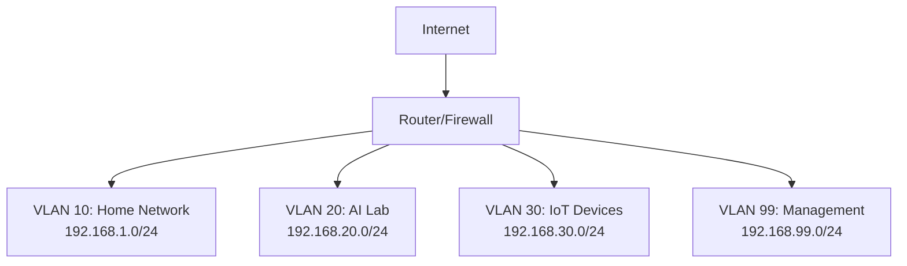

# Securing the Home AI Lab, Network Setup, and Optimization

## Introduction

Security is often overlooked when setting up home AI labs, but it's crucial for protecting your data, models, and computational resources. This guide covers essential security practices, network configuration, and optimization strategies.

## Why Security Matters for AI Labs

**Unique Risks:**
- Valuable datasets (potentially sensitive)
- Expensive computational resources
- Proprietary models and research
- Network-accessible services (Jupyter, APIs)
- Long-running processes (vulnerable to interruption)

**Potential Threats:**
- Unauthorized access to data
- Resource hijacking (crypto mining)
- Data exfiltration
- Model theft
- Ransomware
- DDoS attacks on exposed services

## Physical Security

### Hardware Protection

**Access Control:**
- Lock server room or workspace
- Use cable locks for portable devices
- Secure rack-mounted equipment
- Consider security cameras

**Environmental Protection:**
- Fire suppression system
- Water detection sensors
- Temperature monitoring
- Humidity control
- Surge protectors and UPS

**Data Protection:**
- Full disk encryption
- Secure disposal of old drives
- Physical backup storage (off-site)
- BIOS/UEFI passwords

### Disk Encryption

**Linux (LUKS):**
```bash
# During installation, enable disk encryption
# Or encrypt existing partition:

# Install cryptsetup
sudo apt install cryptsetup

# Encrypt partition (WARNING: destroys data)
sudo cryptsetup luksFormat /dev/sdX

# Open encrypted partition
sudo cryptsetup luksOpen /dev/sdX encrypted_volume

# Format and mount
sudo mkfs.ext4 /dev/mapper/encrypted_volume
sudo mount /dev/mapper/encrypted_volume /mnt/encrypted
```

**Windows (BitLocker):**
```powershell
# Enable BitLocker (Windows Pro/Enterprise)
# Settings → Update & Security → Device encryption
# Or: Control Panel → BitLocker Drive Encryption

# PowerShell
Enable-BitLocker -MountPoint "C:" -EncryptionMethod XtsAes256
```

**macOS (FileVault):**
```bash
# System Preferences → Security & Privacy → FileVault
# Click "Turn On FileVault"

# Command line
sudo fdesetup enable
```

## Network Security

### Firewall Configuration

**Linux (UFW - Uncomplicated Firewall):**
```bash
# Install UFW
sudo apt install ufw

# Default policies
sudo ufw default deny incoming
sudo ufw default allow outgoing

# Allow SSH (be careful!)
sudo ufw allow 22/tcp

# Allow specific services
sudo ufw allow 8888/tcp  # Jupyter
sudo ufw allow 6006/tcp  # TensorBoard

# Allow from specific IP only
sudo ufw allow from 192.168.1.100 to any port 8888

# Enable firewall
sudo ufw enable

# Check status
sudo ufw status verbose

# Delete rule
sudo ufw delete allow 8888/tcp
```

**Linux (iptables - Advanced):**
```bash
# Block all incoming except established
sudo iptables -P INPUT DROP
sudo iptables -A INPUT -m conntrack --ctstate ESTABLISHED,RELATED -j ACCEPT

# Allow loopback
sudo iptables -A INPUT -i lo -j ACCEPT

# Allow SSH from specific subnet
sudo iptables -A INPUT -p tcp -s 192.168.1.0/24 --dport 22 -j ACCEPT

# Allow Jupyter from local network only
sudo iptables -A INPUT -p tcp -s 192.168.1.0/24 --dport 8888 -j ACCEPT

# Save rules
sudo iptables-save > /etc/iptables/rules.v4
```

**Windows Firewall:**
```powershell
# Block incoming by default
Set-NetFirewallProfile -Profile Domain,Public,Private -DefaultInboundAction Block

# Allow specific port
New-NetFirewallRule -DisplayName "Jupyter" -Direction Inbound -LocalPort 8888 -Protocol TCP -Action Allow

# Allow from specific IP
New-NetFirewallRule -DisplayName "Jupyter-Local" -Direction Inbound -LocalPort 8888 -Protocol TCP -RemoteAddress 192.168.1.0/24 -Action Allow

# View rules
Get-NetFirewallRule | Where-Object {$_.Enabled -eq 'True'}
```

### Network Segmentation

**VLAN Setup:**
- Separate AI lab from home network
- Isolate IoT devices
- Create DMZ for internet-facing services
- Use managed switch with VLAN support

**Example Network Topology:**




### VPN Access

**WireGuard (Modern, Fast):**
```bash
# Install WireGuard
sudo apt install wireguard

# Generate keys
wg genkey | tee privatekey | wg pubkey > publickey

# Configure server (/etc/wireguard/wg0.conf)
[Interface]
Address = 10.0.0.1/24
ListenPort = 51820
PrivateKey = <server-private-key>

[Peer]
PublicKey = <client-public-key>
AllowedIPs = 10.0.0.2/32

# Start VPN
sudo wg-quick up wg0

# Enable on boot
sudo systemctl enable wg-quick@wg0
```

**OpenVPN (Traditional):**
```bash
# Install OpenVPN
sudo apt install openvpn easy-rsa

# Setup PKI and certificates
# (Follow OpenVPN documentation)

# Start server
sudo systemctl start openvpn@server
sudo systemctl enable openvpn@server
```

**Tailscale (Easy, Managed):**
```bash
# Install Tailscale
curl -fsSL https://tailscale.com/install.sh | sh

# Authenticate
sudo tailscale up

# Access your lab from anywhere securely
# No port forwarding needed
# Zero-config mesh VPN
```

## Access Control

### SSH Security

**Harden SSH Configuration:**
```bash
# Edit SSH config
sudo nano /etc/ssh/sshd_config

# Recommended settings:
Port 2222  # Change default port
PermitRootLogin no
PasswordAuthentication no  # Use keys only
PubkeyAuthentication yes
MaxAuthTries 3
ClientAliveInterval 300
ClientAliveCountMax 2
AllowUsers yourusername  # Whitelist users
X11Forwarding no  # Unless needed

# Restart SSH
sudo systemctl restart sshd
```

**SSH Key Authentication:**
```bash
# Generate key pair (on client)
ssh-keygen -t ed25519 -C "your_email@example.com"

# Copy public key to server
ssh-copy-id -i ~/.ssh/id_ed25519.pub user@server

# Or manually:
cat ~/.ssh/id_ed25519.pub | ssh user@server 'mkdir -p ~/.ssh && cat >> ~/.ssh/authorized_keys'

# Set permissions on server
chmod 700 ~/.ssh
chmod 600 ~/.ssh/authorized_keys

# Test connection
ssh -i ~/.ssh/id_ed25519 user@server
```

**Fail2Ban (Brute Force Protection):**
```bash
# Install Fail2Ban
sudo apt install fail2ban

# Configure
sudo cp /etc/fail2ban/jail.conf /etc/fail2ban/jail.local
sudo nano /etc/fail2ban/jail.local

# SSH jail settings:
[sshd]
enabled = true
port = 2222
filter = sshd
logpath = /var/log/auth.log
maxretry = 3
bantime = 3600
findtime = 600

# Start service
sudo systemctl start fail2ban
sudo systemctl enable fail2ban

# Check status
sudo fail2ban-client status sshd
```

### Jupyter Notebook Security

**Password Protection:**
```bash
# Generate password hash
jupyter notebook password

# Or manually in Python:
from jupyter_server.auth import passwd
passwd()
# Copy the hash
```

**SSL/TLS Encryption:**
```bash
# Generate self-signed certificate
openssl req -x509 -nodes -days 365 -newkey rsa:2048 \
    -keyout jupyter.key -out jupyter.crt

# Configure Jupyter
jupyter notebook --generate-config

# Edit config (~/.jupyter/jupyter_notebook_config.py)
c.NotebookApp.certfile = '/path/to/jupyter.crt'
c.NotebookApp.keyfile = '/path/to/jupyter.key'
c.NotebookApp.ip = '0.0.0.0'
c.NotebookApp.port = 8888
c.NotebookApp.open_browser = False
c.NotebookApp.password = '<your-hashed-password>'

# Start Jupyter
jupyter lab
# Access via https://your-ip:8888
```

**Token Authentication:**
```bash
# Start with token
jupyter lab --no-browser --port=8888

# Token will be displayed in terminal
# Access: http://localhost:8888/?token=<token>
```

**Reverse Proxy (Nginx):**
```nginx
# /etc/nginx/sites-available/jupyter
server {
    listen 443 ssl;
    server_name jupyter.yourdomain.com;

    ssl_certificate /path/to/cert.pem;
    ssl_certificate_key /path/to/key.pem;

    location / {
        proxy_pass http://localhost:8888;
        proxy_set_header Host $host;
        proxy_set_header X-Real-IP $remote_addr;
        proxy_set_header X-Forwarded-For $proxy_add_x_forwarded_for;
        proxy_set_header X-Forwarded-Proto $scheme;
        
        # WebSocket support
        proxy_http_version 1.1;
        proxy_set_header Upgrade $http_upgrade;
        proxy_set_header Connection "upgrade";
    }
}
```

## Data Security

### Backup Strategy

**3-2-1 Rule:**
- **3** copies of data
- **2** different media types
- **1** off-site backup

**Backup Tools:**

**rsync (Linux/Mac):**
```bash
# Local backup
rsync -avz --progress /source/ /backup/

# Remote backup
rsync -avz -e ssh /source/ user@remote:/backup/

# Incremental backup with hard links
rsync -avz --link-dest=/backup/previous /source/ /backup/current/

# Exclude large files
rsync -avz --exclude='*.tmp' --exclude='cache/' /source/ /backup/
```

**Automated Backup Script:**
```bash
#!/bin/bash
# backup.sh

SOURCE="/home/user/ai-projects"
DEST="/mnt/backup/ai-projects"
DATE=$(date +%Y-%m-%d)

# Create backup
rsync -avz --delete \
    --exclude='*.pyc' \
    --exclude='__pycache__' \
    --exclude='.git' \
    --exclude='venv' \
    $SOURCE $DEST-$DATE

# Keep only last 7 days
find /mnt/backup -name "ai-projects-*" -mtime +7 -exec rm -rf {} \;

# Log
echo "Backup completed: $(date)" >> /var/log/backup.log
```

**Schedule with cron:**
```bash
# Edit crontab
crontab -e

# Daily backup at 2 AM
0 2 * * * /home/user/scripts/backup.sh

# Weekly backup on Sunday at 3 AM
0 3 * * 0 /home/user/scripts/backup.sh
```

### Dataset Security

**Access Control:**
```bash
# Set proper permissions
chmod 700 ~/datasets  # Only owner can access
chmod 600 ~/datasets/sensitive.csv  # Only owner can read/write

# Use ACLs for fine-grained control
setfacl -m u:username:r ~/datasets/shared.csv
```

**Encryption for Sensitive Data:**
```bash
# Encrypt file
gpg --symmetric --cipher-algo AES256 sensitive_data.csv

# Decrypt
gpg sensitive_data.csv.gpg

# Encrypt directory
tar czf - sensitive_dir/ | gpg --symmetric --cipher-algo AES256 -o sensitive_dir.tar.gz.gpg

# Decrypt
gpg -d sensitive_dir.tar.gz.gpg | tar xzf -
```

## Network Optimization

### Bandwidth Optimization

**Quality of Service (QoS):**
- Prioritize AI training traffic
- Limit background downloads
- Configure on router

**Traffic Shaping (Linux):**
```bash
# Install tc (traffic control)
sudo apt install iproute2

# Limit bandwidth for specific interface
sudo tc qdisc add dev eth0 root tbf rate 1mbit burst 32kbit latency 400ms

# Remove limit
sudo tc qdisc del dev eth0 root
```

### Local Network Performance

**Jumbo Frames (for 10GbE):**
```bash
# Check current MTU
ip link show eth0

# Set MTU to 9000 (jumbo frames)
sudo ip link set eth0 mtu 9000

# Make permanent (Ubuntu)
# Edit /etc/netplan/01-netcfg.yaml
network:
  version: 2
  ethernets:
    eth0:
      mtu: 9000

sudo netplan apply
```

**TCP Tuning:**
```bash
# Edit /etc/sysctl.conf
sudo nano /etc/sysctl.conf

# Add these lines:
net.core.rmem_max = 134217728
net.core.wmem_max = 134217728
net.ipv4.tcp_rmem = 4096 87380 67108864
net.ipv4.tcp_wmem = 4096 65536 67108864
net.core.netdev_max_backlog = 5000

# Apply changes
sudo sysctl -p
```

### NFS Optimization (for shared storage)

```bash
# Server /etc/exports
/data 192.168.20.0/24(rw,sync,no_subtree_check,no_root_squash)

# Mount with optimized options
sudo mount -t nfs -o rw,hard,intr,rsize=131072,wsize=131072,tcp server:/data /mnt/data

# Add to /etc/fstab
server:/data /mnt/data nfs rw,hard,intr,rsize=131072,wsize=131072,tcp 0 0
```

## Monitoring and Logging

### System Monitoring

**Install Monitoring Tools:**
```bash
# htop - Interactive process viewer
sudo apt install htop

# iotop - I/O monitoring
sudo apt install iotop

# nethogs - Network bandwidth by process
sudo apt install nethogs

# glances - All-in-one monitoring
sudo apt install glances
```

**GPU Monitoring:**
```bash
# NVIDIA
watch -n 1 nvidia-smi

# Or install nvtop
sudo apt install nvtop
nvtop
```

### Centralized Logging

**Syslog Configuration:**
```bash
# Edit /etc/rsyslog.conf
sudo nano /etc/rsyslog.conf

# Send logs to remote server
*.* @192.168.20.10:514  # UDP
*.* @@192.168.20.10:514  # TCP

# Restart rsyslog
sudo systemctl restart rsyslog
```

**Log Rotation:**
```bash
# Configure logrotate
sudo nano /etc/logrotate.d/ai-lab

/var/log/ai-lab/*.log {
    daily
    rotate 7
    compress
    delaycompress
    missingok
    notifempty
}
```

## Security Checklist

### Initial Setup

- [ ] Enable disk encryption
- [ ] Configure firewall (deny all incoming by default)
- [ ] Change default SSH port
- [ ] Disable SSH password authentication
- [ ] Install and configure Fail2Ban
- [ ] Set up automatic security updates
- [ ] Create non-root user for daily use
- [ ] Disable unnecessary services

### Network Security

- [ ] Change default router password
- [ ] Enable WPA3 on WiFi
- [ ] Disable WPS
- [ ] Set up VPN for remote access
- [ ] Configure network segmentation (VLANs)
- [ ] Enable router firewall
- [ ] Disable UPnP
- [ ] Use strong DNS (1.1.1.1, 8.8.8.8)

### Application Security

- [ ] Password-protect Jupyter notebooks
- [ ] Enable SSL/TLS for web services
- [ ] Use strong, unique passwords
- [ ] Enable 2FA where possible
- [ ] Keep software updated
- [ ] Review and limit API access
- [ ] Secure API keys (environment variables, not code)

### Data Security

- [ ] Implement 3-2-1 backup strategy
- [ ] Encrypt sensitive datasets
- [ ] Set proper file permissions
- [ ] Regular backup testing
- [ ] Secure deletion of old data
- [ ] Document data handling procedures

### Monitoring

- [ ] Set up system monitoring
- [ ] Configure log aggregation
- [ ] Enable intrusion detection
- [ ] Monitor disk space
- [ ] Track failed login attempts
- [ ] Set up alerts for anomalies

## Best Practices

1. **Principle of Least Privilege** - Grant minimum necessary access
2. **Defense in Depth** - Multiple layers of security
3. **Regular Updates** - Keep all software current
4. **Strong Authentication** - Use keys, not passwords
5. **Encrypt Everything** - Data at rest and in transit
6. **Monitor Actively** - Know what's happening on your network
7. **Backup Regularly** - Test restores periodically
8. **Document Everything** - Procedures, configs, incidents
9. **Stay Informed** - Follow security news and advisories
10. **Plan for Incidents** - Have a response plan

## Next Steps

- **[Segment 2: Cloud-Based AI Labs](../segment-2-cloud-based-ai-labs/)** - Explore cloud security
- **[Segment 3: Integrating AI Environments](../segment-3-integrating-and-leveraging-ai-environments/)** - Hybrid security considerations

## Resources

- HackerRepository - https://hackerrepo.org 
- Hacker Training - https://hackertraining.org
- OWASP - https://owasp.org/
- NIST Cybersecurity Framework - https://www.nist.gov/cyberframework
- OWASP Top 10 - https://owasp.org/www-project-top-ten/
- CIS Benchmarks - https://www.cisecurity.org/cis-benchmarks/
- /r/homelab - Reddit community for home lab security
- Awesome Security - https://github.com/sbilly/awesome-security
